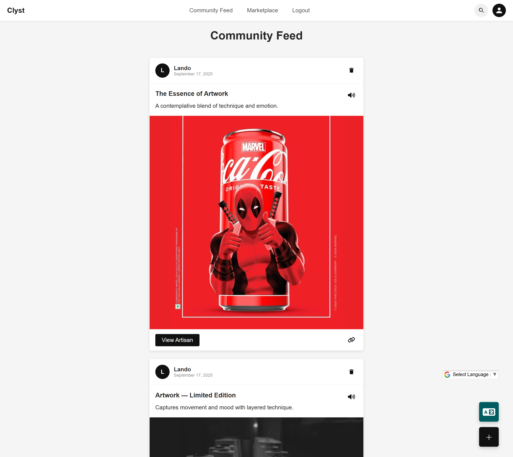
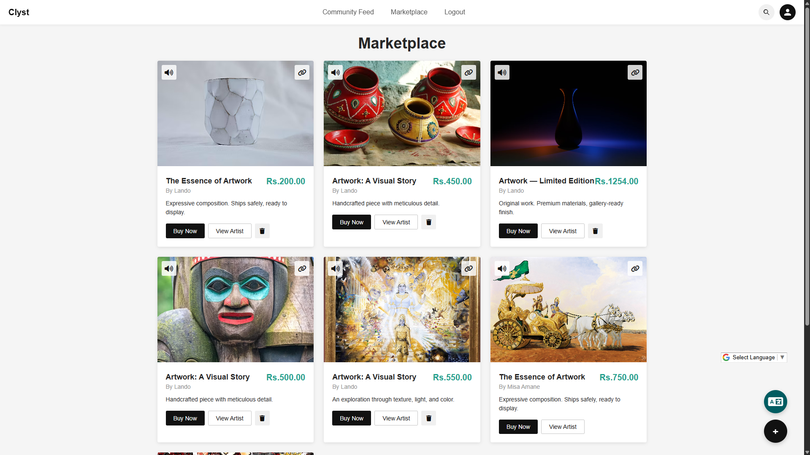
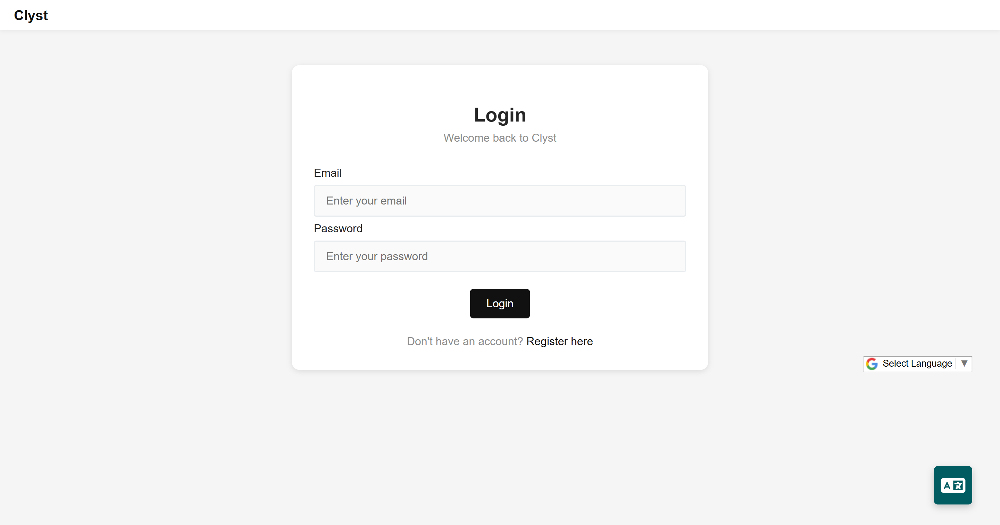
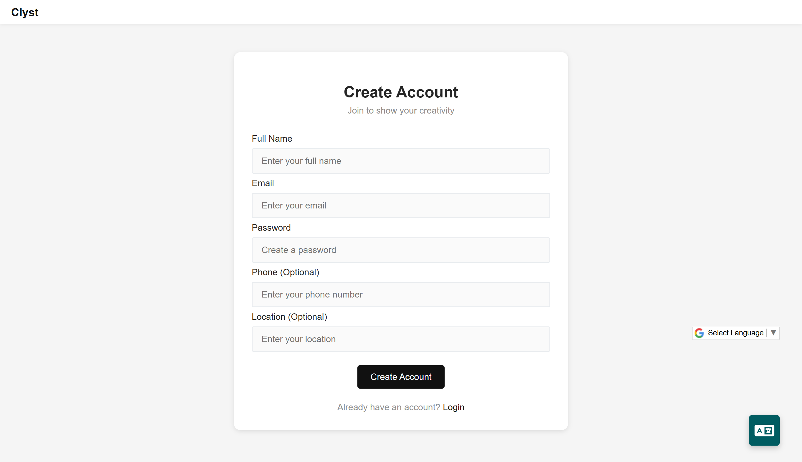
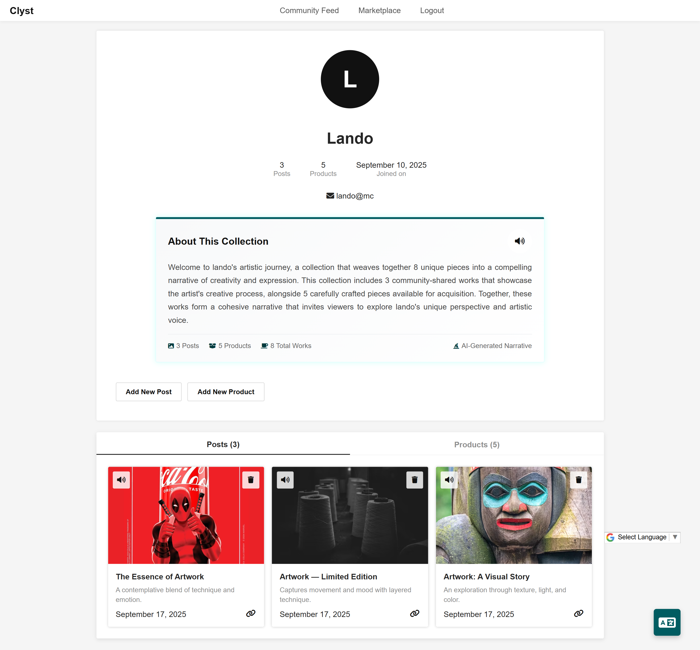

# Clyst - Art Marketplace & Community Platform

Clyst is a comprehensive web application that serves as both a social platform for artists to share their work and a marketplace for selling artwork. Built with Flask and featuring AI-powered content generation, natural language search, and multilingual support.

## 🌟 Features

### Core Functionality
- **Community Feed**: Artists can share their artwork with the community through posts
- **Marketplace**: Buy and sell artwork with integrated pricing and product management
- **User Authentication**: Secure registration, login, and profile management with Flask-Login
- **Image Management**: Support for both URL-based and file upload images with secure handling
- **Search & Discovery**: Natural language search with price filtering capabilities
- **Portfolio Management**: AI-generated portfolio narratives for artist profiles

### AI-Powered Features
- **Content Generation**: AI-powered title and description suggestions for posts and products using Google Gemini
- **Multilingual Support**: Automatic translation of content into 15+ languages including Indian languages
- **SEO Optimization**: AI-generated SEO phrases for better discoverability
- **Image Analysis**: AI analyzes uploaded images to generate contextual content
- **Portfolio Narratives**: AI creates compelling stories connecting an artist's works

### Advanced Search
- **Natural Language Processing**: Search using phrases like "minimalist monochrome abstracts under ₹5k"
- **Price Filtering**: Support for price ranges, minimum/maximum price constraints
- **Keyword Extraction**: Intelligent keyword parsing from search queries
- **Multi-field Search**: Search across titles, descriptions, and artist names
- **Currency Support**: Handles ₹, Rs, INR with k/M suffixes (e.g., "5k", "2M")

### User Experience
- **Responsive Design**: Mobile-first design with adaptive layouts
- **Accessibility**: Text-to-speech functionality for content
- **Modern UI**: Clean, Instagram-inspired interface with smooth animations
- **Real-time Features**: Dynamic content updates and interactive elements
- **File Upload Security**: Secure filename handling and type validation

## 🛠️ Technology Stack

### Backend
- **Flask 3.0.0**: Web framework
- **SQLAlchemy 2.0.38**: ORM for database operations
- **Flask-Login 0.6.3**: User authentication and session management
- **Flask-SQLAlchemy 3.1.1**: Flask integration with SQLAlchemy
- **Flask-Bootstrap5 0.1.dev1**: Bootstrap integration
- **Flask-CKEditor 1.0.0**: Rich text editor
- **Werkzeug 3.0.1**: WSGI toolkit with password hashing
- **python-dotenv 1.0.1**: Environment variable management

### Frontend
- **HTML5/CSS3**: Modern web standards with CSS Grid and Flexbox
- **JavaScript (ES6+)**: Interactive functionality and AJAX requests
- **Font Awesome 6.0.0**: Icon library
- **Responsive Design**: Mobile-first approach with adaptive layouts
- **CSS Variables**: Consistent theming and styling

### AI Integration
- **Google Gemini API**: AI content generation and translation
- **Natural Language Processing**: Custom search query parser
- **Image Analysis**: AI-powered image understanding
- **Multilingual Support**: 15+ languages including Indian languages

### Database
- **SQLite**: Lightweight database for development
- **Database Migrations**: Automatic table creation and management
- **File Storage**: Local file system with organized uploads

## 📁 Project Structure

```
ClystProto/
├── app.py                 # Main Flask application with all routes and models
├── config.py             # Configuration settings and API keys
├── natural_search.py     # Natural language search parser
├── ai.py                 # AI integration module for portfolio narratives
├── requirements.txt      # Python dependencies
├── .gitignore           # Git ignore rules
├── models/
│   └── dbs.py           # Database models (commented out - models in app.py)
├── templates/           # HTML templates
│   ├── index.html       # Community feed with search functionality
│   ├── products.html    # Marketplace with price filtering
│   ├── add_posts.html   # Create post form with AI suggestions
│   ├── add_products.html # Add product form with AI suggestions
│   ├── profile.html     # User profile with portfolio narrative
│   ├── login.html       # Login page
│   ├── register.html    # Registration page
│   └── product_buy.html # Product purchase page
├── static/
│   ├── css/
│   │   └── styles.css   # Global styles and common components
│   └── uploads/         # User uploaded files
│       ├── posts/       # Post images with UUID naming
│       └── products/    # Product images with UUID naming
└── instance/
    └── clyst.db        # SQLite database
```

## 🚀 Installation & Setup

### Prerequisites
- Python 3.8 or higher
- pip (Python package installer)

### Installation Steps

1. **Clone the repository**
   ```bash
   git clone <repository-url>
   cd ClystProto
   ```

2. **Create a virtual environment**
   ```bash
   python -m venv venv
   source venv/bin/activate  # On Windows: venv\Scripts\activate
   ```

3. **Install dependencies**
   ```bash
   pip install -r requirements.txt
   ```

4. **Configure environment variables**
   - Edit `config.py` to set your API keys:
   ```python
   GEMINI_API_KEY = "your_gemini_api_key_here"
   FLASK_SECRET_KEY = "your_secret_key_here"
   ```

5. **Run the application**
   ```bash
   python app.py
   ```

6. **Access the application**
   - Open your browser and navigate to `http://localhost:5000`

## 🔧 Configuration

### API Keys Setup
1. **Google Gemini API**:
   - Visit [Google AI Studio](https://makersuite.google.com/app/apikey)
   - Create a new API key
   - Add it to `config.py`

2. **Flask Secret Key**:
   - Generate a secure secret key for session management
   - Update `FLASK_SECRET_KEY` in `config.py`

### Database Configuration
- The application uses SQLite by default
- Database file is created automatically in the `instance/` directory
- Tables are created on first run

## 📱 Usage Guide

### For Artists

1. **Registration & Profile**
   - Create an account with email, name, phone, and location
   - Access your profile to manage posts and products

2. **Creating Posts**
   - Share artwork with the community
   - Upload images or provide image URLs
   - Use AI to generate engaging titles and descriptions
   - Translate content into multiple languages

3. **Selling Products**
   - Add products to the marketplace
   - Set prices and detailed descriptions
   - Use AI suggestions for better product listings
   - Manage your product inventory

### For Buyers

1. **Browsing & Discovery**
   - Explore the community feed for inspiration
   - Browse the marketplace for products
   - Use natural language search (e.g., "abstract paintings under 5000")

2. **Search Features**
   - Search by keywords, artist names, or descriptions
   - Filter by price ranges
   - Use phrases like "landscape oil painting below 7500"

3. **Product Interaction**
   - View detailed product information
   - Contact artists through their profiles
   - Use text-to-speech for accessibility

## 🔍 Search Capabilities

The application features an advanced natural language search system that understands:

### Price Queries
- `"under ₹5k"` - Maximum price filter
- `"above 2000"` - Minimum price filter
- `"between 1000 and 5000"` - Price range filter
- `"rs 1200"` - Exact price search
- `"less than 3k"` - Alternative syntax
- `"upto 7500"` - Maximum price constraint

### Style & Content Queries
- `"minimalist monochrome abstracts"` - Style-based search
- `"blue portrait"` - Color and subject search
- `"landscape oil painting"` - Medium and subject search
- `"abstract art"` - Genre-based search

### Combined Queries
- `"minimalist monochrome abstracts under ₹5k"` - Style + price
- `"blue portrait < 2000"` - Color + subject + price
- `"landscape painting between 2k and 8k"` - Subject + price range

### Currency Support
- Supports ₹, Rs, INR notations
- Handles k/M suffixes (5k = 5000, 2M = 2,000,000)
- Removes thousand separators (1,200 → 1200)

## 🤖 AI Features

### Content Generation
- **Title Suggestions**: AI generates 3 varied engaging titles based on artwork analysis
- **Description Writing**: Contextual descriptions highlighting artistic elements
- **Style Adaptation**: Different suggestions for posts vs. products
- **Image Analysis**: AI analyzes uploaded images to understand content and context
- **Portfolio Narratives**: AI creates compelling stories connecting an artist's works

### Translation Support
- **Multi-language**: Support for 15+ languages including Indian languages
- **SEO Optimization**: Translated content includes SEO phrases for better discoverability
- **Cultural Adaptation**: Translations consider cultural context
- **Language Detection**: Automatic detection of source language using Unicode ranges
- **Fallback Support**: Graceful degradation when AI services are unavailable

### Supported Languages
- **Indian Languages**: Hindi, Bengali, Tamil, Telugu, Marathi, Gujarati, Kannada, Malayalam, Punjabi, Urdu
- **International**: English, Spanish, French, German, Chinese, Japanese, Korean, Russian, Greek, Hebrew, Arabic
- **Script Support**: Devanagari, Bengali, Gurmukhi, Gujarati, Tamil, Telugu, Kannada, Malayalam, Arabic, CJK, Cyrillic, Greek, Hebrew

## 🎨 User Interface

### Design Philosophy
- **Clean & Modern**: Instagram-inspired interface
- **Mobile-First**: Responsive design for all devices
- **Accessibility**: Text-to-speech and keyboard navigation
- **Performance**: Optimized loading and smooth animations

### Key UI Components
- **Navigation**: Sticky header with search functionality
- **Cards**: Consistent card-based layout for posts and products
- **Forms**: Intuitive forms with real-time validation
- **Modals**: Smooth overlay interactions
- **Grid Layouts**: Responsive grid systems

## 📸 Screenshots

### Home Page - Community Feed

*The main community feed showcasing artists' posts with search functionality and responsive design.*

### Marketplace

*The marketplace page displaying products with price filtering and natural language search capabilities.*

### Add Post Page with AI Suggestions & Translation

*Create post form featuring AI-powered title and description suggestions based on uploaded artwork and multilingual translation capabilities.*

### Add Product Page with AI & Translation

*Add product form showcasing AI content generation and multilingual translation capabilities.*

### Login Page

*Clean and modern login interface with secure authentication.*

### Registration Page

*User registration form with comprehensive profile setup including location and contact information.*

### Profile Page

*User profile page showcasing portfolio with AI-generated narrative and management options for posts and products.*

## 🔒 Security Features

- **Password Hashing**: Secure password storage using Werkzeug
- **Session Management**: Flask-Login for secure sessions
- **File Upload Security**: Secure filename handling and type validation
- **Input Validation**: Server-side validation for all inputs
- **CSRF Protection**: Built-in CSRF protection with Flask

## 📊 Database Schema

### Users Table
- `id`: Primary key (auto-increment)
- `name`: User's display name (String, 100 chars)
- `email`: Unique email address (String, 100 chars)
- `password_hash`: Hashed password using Werkzeug (String, 255 chars)
- `phone`: Contact number (String, 20 chars)
- `location`: User's location (String, 150 chars)
- `created_at`: Account creation date (String, 250 chars)
- **Relationships**: One-to-many with Posts and Products

### Posts Table
- `post_id`: Primary key (auto-increment)
- `artist_id`: Foreign key to users.id
- `post_title`: Post title (String, 255 chars)
- `description`: Post description (Text)
- `media_url`: Image URL or path (String, 255 chars)
- `created_at`: Post creation date (String, 255 chars)
- **Relationships**: Many-to-one with User

### Products Table
- `product_id`: Primary key (auto-increment)
- `artist_id`: Foreign key to users.id
- `title`: Product name (String, 150 chars)
- `description`: Product description (Text)
- `price`: Product price (Numeric, 10 digits, 2 decimal places)
- `img_url`: Product image URL or path (String, 255 chars)
- `created_at`: Product creation date (String, 250 chars)
- **Relationships**: Many-to-one with User

## 🚀 Deployment

### Production Considerations
1. **Environment Variables**: Use environment variables for sensitive data
2. **Database**: Consider PostgreSQL for production
3. **File Storage**: Use cloud storage for uploaded files
4. **HTTPS**: Enable SSL/TLS for secure communication
5. **Caching**: Implement Redis for session storage
6. **Load Balancing**: Use Gunicorn or similar WSGI server

### Environment Setup
```bash
export FLASK_ENV=production
export GEMINI_API_KEY=your_production_key
export FLASK_SECRET_KEY=your_production_secret
```

## 🤝 Contributing

1. Fork the repository
2. Create a feature branch (`git checkout -b feature/amazing-feature`)
3. Commit your changes (`git commit -m 'Add amazing feature'`)
4. Push to the branch (`git push origin feature/amazing-feature`)
5. Open a Pull Request

## 📝 License

This project is licensed under the MIT License - see the LICENSE file for details.


## 🔮 Future Enhancements

- **Payment Integration**: Stripe/PayPal integration for transactions
- **Advanced AI**: More sophisticated content generation and image analysis
- **Social Features**: Comments, likes, and following system
- **Mobile App**: Native mobile application
- **Advanced Search**: Image-based search and recommendation system
- **Analytics Dashboard**: Artist performance metrics and insights
- **Messaging System**: Direct communication between artists and buyers
- **Order Management**: Complete e-commerce functionality
- **Review System**: Product reviews and ratings
- **Categories**: Art categorization and filtering


## 📝 Development Notes

- The application uses a single-file approach with models defined in `app.py`
- AI features gracefully degrade when API keys are not configured
- File uploads use UUID naming to prevent conflicts
- Natural language search is implemented as a lightweight parser
- Portfolio narratives are generated on-demand for better performance

---

**Clyst** - Where Art Meets Community and Commerce
